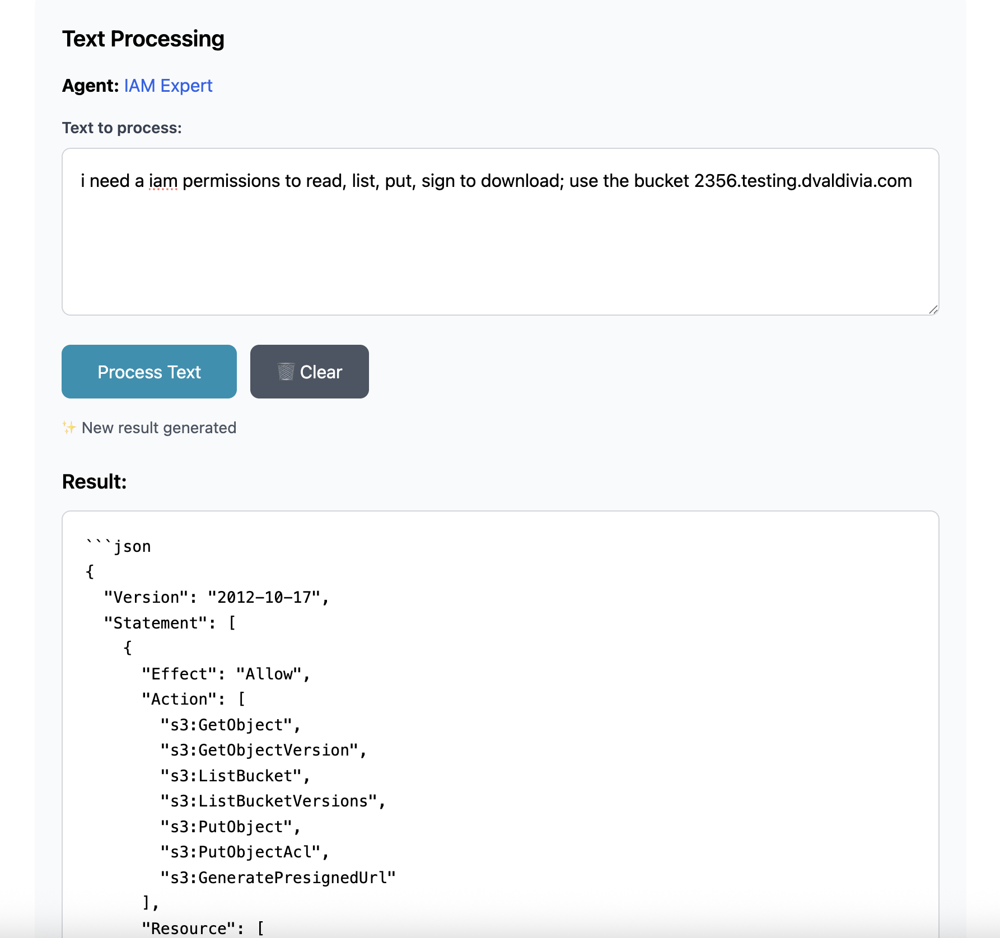

# Claude Code Local Agents

Create custom AI agents locally using your Claude Pro subscription through Claude Code terminal.

## What it does

This simple Node.js app lets you create specialized AI agents with different personalities and expertise areas. Each agent can answer questions independently using your existing Claude Pro subscription - no API costs required.

**Key Features:**
- Create descriptive AI agents with specific roles and expertise
- Ask questions and get responses through your Claude Pro subscription
- Web-based interface at http://localhost:3000
- Each question is independent (no conversation memory)




## Prerequisites

- **Claude Pro Subscription** (required)
- **Claude Code** installed and configured
- **Node.js** (v16 or higher)

## Installation

1. **Clone the repository**
   ```bash
   git clone https://github.com/david-valdivia/claude-code-local-agents.git
   cd claude-code-local-agents
   ```

2. **Install dependencies**
   ```bash
   npm install
   ```

3. **Make sure Claude Code is configured**
   ```bash
   # Check if Claude Code is installed and authenticated
   claude --version
   claude auth status
   ```
   
   If not configured, follow the [Claude Code setup instructions](https://docs.anthropic.com).

## Basic Usage

1. **Start the app**
   ```bash
   npm start
   ```

2. **Open your browser**
   
   Go to `http://localhost:3000` - you'll see a web interface to create and manage your agents.

3. **Create an agent**
   
   Use the web interface to create agents with custom names, descriptions, and expertise areas.

4. **Ask questions**
   
   Select an agent and ask questions through the web interface. Each response uses your Claude Pro subscription.

That's it! Your agents will use your Claude Pro subscription to provide responses.

## License

MIT License - see [LICENSE](LICENSE) file for details.

---

**Repository**: https://github.com/david-valdivia/claude-code-local-agents
